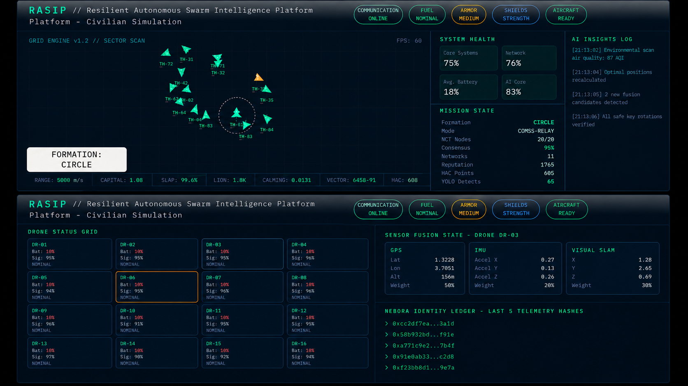
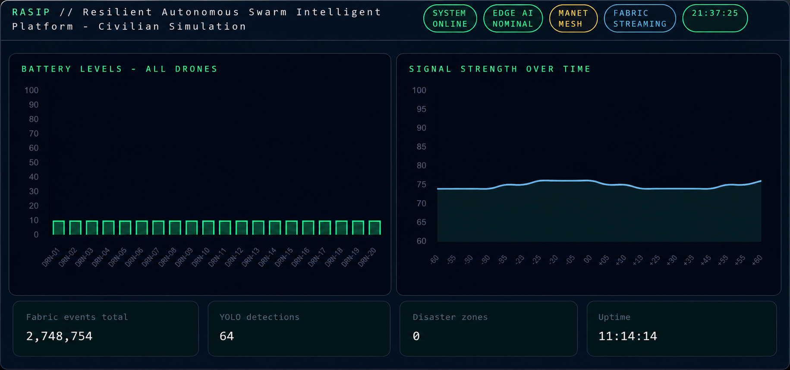

# 🛸 RASIP — Resilient Autonomous Swarm Intelligence Platform

> End-to-end civilian disaster-response drone swarm · AI · Edge · Cloud · Blockchain

[](https://github.com/danielmuthama23/RASIP---Resilient_Autonomous_Swarm_Intelligence_Platform-.git)
[](https://github.com/danielmuthama23/RASIP---Resilient_Autonomous_Swarm_Intelligence_Platform-.git)
[](https://github.com/danielmuthama23/RASIP---Resilient_Autonomous_Swarm_Intelligence_Platform-.git)
[](https://github.com/danielmuthama23/RASIP---Resilient_Autonomous_Swarm_Intelligence_Platform-.git)
[](LICENSE)

---



## 🧩 Project Overview

RASIP is a production-grade, end-to-end intelligent autonomous drone swarm platform built for **civilian disaster response, search & rescue, environmental monitoring, infrastructure inspection, smart city operations, and emergency communications recovery**. It unifies computer vision, IoT sensor streams, boid swarm physics, retrieval-augmented memory (RAG), blockchain-inspired identity verification, MANET mesh networking, and Microsoft Fabric cloud analytics into a single continuously adaptive, self-healing autonomous intelligence ecosystem.

---


## 📋 Module Overview

| Module | Description |
|--------|-------------|
| **01 · Data & Setup** | Delta Lakehouse ingestion, IoT sensor simulation, EventStream configuration, PostgreSQL + Redis initialisation |
| **02 · Boid Swarm Engine** | Separation, alignment, cohesion physics; V-Wing / Circle / Grid / Diamond / Search-Grid formation control; 20-drone async tick loop |
| **03 · Edge AI (YOLO + SLAM)** | YOLOv8n object detection, Visual SLAM fallback navigation, LiDAR obstacle processing, GPS → SLAM → swarm-relative chain |
| **04 · Sensor Fusion** | GPS × 0.5 + IMU × 0.2 + SLAM × 0.3 weighted blend with per-drone Kalman filter noise reduction and GPS-degraded re-weighting |
| **05 · MANET Networking** | QUIC primary, MQTT fallback, ZeroMQ emergency; dynamic ad-hoc mesh topology; swarm consensus voting with VOTE_TTL expiry |
| **06 · MCP Context Engine** | Thread-safe shared drone context store, consensus agreement metric, 50-snapshot per-drone history for RAG and Copilot Studio |
| **07 · RAG Intelligence** | Qdrant vector store, Sentence-Transformers (all-MiniLM-L6-v2), seeded mission knowledge base, semantic similarity retrieval |
| **08 · Security Layer** | AES-256-GCM encryption, SHA-256 Hedera-style identity ledger, SignatureValidator, UUID drone credentials, biometric operator auth |
| **09 · Fabric / Cloud** | Azure Event Hub async producer, Microsoft Fabric OneLake, KQL analytics, SwarmAnalytics stdev anomaly detection, retraining trigger |
| **10 · AI Retraining** | Confidence-threshold trigger (avg_ai_conf < 0.75), collect → dataset → YOLOv8n fine-tune → TinyML export → edge hot-reload |
| **11 · Frontend Dashboard** | 5-tab live simulation: Swarm Theater, Live Telemetry, Data Pipeline, MANET Network, Analytics charts; VS Code-style code explorer |

---

## 🏗️ System Architecture

```
┌─────────────────────────────────────────────────────────────────┐
│              CLOUD CONTROL LAYER (Microsoft Fabric)             │
│     Fabric Lakehouse · Azure Event Hub · AI Foundry · OneLake  │
└───────────────────────────────┬─────────────────────────────────┘
                                │ Encrypted Streams (AES-256-GCM)
┌───────────────────────────────▼─────────────────────────────────┐
│               SWARM NETWORKING LAYER (MANET Mesh)               │
│    QUIC Primary · MQTT Fallback · ZeroMQ Emergency · MCP Sync  │
└───────────────────────────────┬─────────────────────────────────┘
                                │
┌───────────────────────────────▼─────────────────────────────────┐
│                EDGE AI DRONE LAYER (20 Drones)                  │
│     YOLOv8 · Sensor Fusion · GPS + SLAM · Kalman · LiDAR       │
└───────────────────────────────┬─────────────────────────────────┘
                                │
┌───────────────────────────────▼─────────────────────────────────┐
│              FRONTEND COMMAND CENTER (Next.js 14)               │
│    Swarm Theater · Telemetry · Mesh Network · Analytics         │
└─────────────────────────────────────────────────────────────────┘
```

### Complete End-to-End Data Flow

| Step | Stage | Detail |
|------|-------|--------|
| **01** | Drone Sensors | GPS + IMU + LiDAR + Camera |
| **02** | Edge AI Inference | YOLOv8n + TinyML on device |
| **03** | Sensor Fusion | GPS × 0.5 + IMU × 0.2 + SLAM × 0.3 (Kalman) |
| **04** | Boid Engine | Separation · Alignment · Cohesion |
| **05** | MCP Context Sync | 20-node distributed consensus |
| **06** | AES-256 Encryption | Hedera SHA-256 TX signing |
| **07** | Event Hub Streaming | Azure Kafka-compatible pipeline |
| **08** | Fabric Analytics | KQL · OneLake · Power BI Dashboards |
| **09** | Digital Twin + RAG | Cloud mirror sync + Qdrant embeddings |
| **10** | AI Model Retraining | Collect → Dataset → Fine-tune → Deploy edge |

---


## 📁 File Structure

```
autonomous-swarm-platform/
│
├── frontend/                          # Next.js 14 · React · Three.js · Tailwind
│   ├── app/
│   │   ├── layout.tsx                 # Global shell, auth wrappers, providers
│   │   ├── page.tsx                   # Root redirect → /dashboard
│   │   ├── dashboard/
│   │   │   └── page.tsx               # Real-time command centre
│   │   └── digital-twin/
│   │       └── page.tsx               # Live 3D virtual simulation
│   ├── components/
│   │   ├── SwarmScene.tsx             # Three.js instanced mesh — 1 draw call / 20 drones
│   │   ├── TelemetryPanel.tsx         # Live GPS, battery, signal cards
│   │   ├── RadarPanel.tsx             # Canvas 2D radar sweep + blips
│   │   ├── ATCConsole.tsx             # Air traffic control command input
│   │   ├── CameraFeed.tsx             # RTSP / WebRTC drone stream
│   │   ├── MapView.tsx                # Mapbox GL geospatial view
│   │   ├── AnalyticsChart.tsx         # Recharts / Chart.js panels
│   │   └── AIInsightsPanel.tsx        # Explainable AI reasoning log
│   ├── services/
│   │   ├── websocket.ts               # Auto-reconnect, binary stream, Redux dispatch
│   │   ├── fabric.ts                  # Fabric KQL + anomaly report polling
│   │   └── hedera.ts                  # TX hash integrity check
│   ├── package.json
│   ├── tailwind.config.ts
│   ├── next.config.ts
│   └── tsconfig.json
│
├── backend/                           # FastAPI · Python 3.11 · asyncio
│   ├── main.py                        # FastAPI init, routes, lifespan scheduler
│   ├── websocket_server.py            # Broadcast telemetry + alerts
│   ├── telemetry.py                   # 10 Hz telemetry generator
│   ├── sensor_fusion.py               # GPS×0.5 + IMU×0.2 + SLAM×0.3 + Kalman
│   ├── navigation.py                  # Waypoint + GPS fallback logic
│   ├── mcp_context.py                 # Shared drone context store
│   ├── swarm/
│   │   ├── boids_engine.py            # Separation, alignment, cohesion — 30 Hz
│   │   ├── formation_control.py       # V-wing, circle, grid, diamond, search
│   │   ├── collision_avoidance.py     # LiDAR + radar + exponential repulsion
│   │   └── swarm_consensus.py         # Voting + state propagation (92% quorum)
│   ├── rag/
│   │   ├── vector_store.py            # Qdrant embeddings + indexing
│   │   ├── retriever.py               # Semantic similarity search + re-ranking
│   │   └── mission_knowledge.py       # Swarm long-term memory + doctrine seed
│   ├── security/
│   │   ├── hedera_identity.py         # SHA-256 identity ledger (append-only)
│   │   ├── encryption.py              # AES-256-CBC payloads
│   │   └── signature_validation.py    # UUID drone credentials + HMAC validation
│   ├── networking/
│   │   ├── mesh_protocol.py           # MANET node register + flood broadcast
│   │   ├── consensus.py               # Distributed state sync (Raft-lite)
│   │   ├── quic_transport.py          # Primary QUIC messaging + ACK retry
│   │   └── mqtt_fallback.py           # IoT fallback protocol + DLQ
│   ├── fabric/
│   │   ├── fabric_stream.py           # Azure Event Hub async producer
│   │   ├── analytics.py               # KQL + stdev anomaly detection
│   │   └── retraining_pipeline.py     # Collect → fine-tune → deploy pipeline
│   └── requirements.txt
│
├── edge/                              # On-drone AI inference
│   ├── yolo_detector.py               # YOLOv8 inference, bounding boxes
│   ├── slam_engine.py                 # Visual SLAM, position estimate
│   ├── lidar_processor.py             # Obstacle map, terrain depth
│   ├── gps_fallback.py                # GPS → SLAM → swarm positioning chain
│   ├── obstacle_avoidance.py          # Reroute if clearance < 5 m
│   ├── fusion/
│   │   ├── sensor_fusion.py           # Unified position from 4 sensors
│   │   └── kalman_filter.py           # 6-DOF EKF, noise reduction, Mahalanobis
│   └── models/
│       ├── yolov8n.pt                 # Nano detection weights (3.2 M params)
│       ├── tinyml_classifier.tflite   # Embedded edge inference (INT8, 248 KB)
│       └── model_registry.py          # Load, checksum, hot-swap weights
│
├── networking/                        # Top-level networking layer
│   ├── mesh_protocol.py               # MANET node register + broadcast
│   ├── consensus.py                   # Distributed state sync
│   ├── quic_transport.py              # Primary QUIC messaging
│   ├── mqtt_fallback.py               # IoT fallback protocol
│   └── zeromq_emergency.py            # Last-resort PUSH/PULL emergency channel
│
├── ai-models/                         # AI model management
│   ├── federated_learning.py          # Federated model updates (FedAvg)
│   ├── tinyml_export.py               # TinyML export pipeline (INT8 quantise)
│   └── retraining.py                  # Confidence-threshold retrain trigger
│
├── fabric/                            # Microsoft Fabric / Azure cloud
│   ├── event_hub.py                   # Azure Event Hub async producer
│   ├── kql_analytics.py               # KQL analytics queries + anomaly detection
│   └── onelake.py                     # Microsoft Fabric OneLake Parquet / Delta
│
├── security/                          # Top-level security layer
│   ├── aes_encryption.py              # AES-256-GCM + PBKDF2 key derivation
│   ├── hedera_sha256.py               # Chain-linked SHA-256 identity ledger
│   └── biometric_auth.py              # FaceNet embedding + HMAC session tokens
│
├── infrastructure/                    # Kubernetes manifests
│   ├── k8s.yaml                       # Namespace, Deployments, Services, ConfigMap
│   ├── ingress.yaml                   # NGINX ingress, TLS, WebSocket upgrade
│   └── hpa.yaml                       # HPA — CPU/memory/custom metrics autoscaler
│
├── docker/                            # Container definitions
│   ├── docker-compose.yml             # Full local dev stack (7 services)
│   ├── frontend.Dockerfile            # Multi-stage Next.js standalone build
│   ├── backend.Dockerfile             # Multi-stage Python 3.11 + uvicorn
│   └── edge.Dockerfile                # Python + OpenCV + YOLOv8 + TFLite
│
├── monitoring/                        # Observability
│   ├── prometheus.yml                 # Scrape configs + alert rules
│   └── grafana-dashboard.json         # 8-panel swarm command dashboard
│
├── tests/
│   ├── test_boids.py
│   ├── test_fusion.py
│   ├── test_security.py
│   └── test_consensus.py
│
├── scripts/
│   ├── seed_drones.py
│   └── simulate_telemetry.py
│
├── .env.example
└── README.md
```

---

## 🧰 Technology Stack

| Layer | Tools & Frameworks |
|-------|-------------------|
| **Frontend** | Next.js 14, React 18, Three.js / React Three Fiber, Tailwind CSS, Mapbox GL, Recharts, Chart.js, Redux Toolkit |
| **Backend** | FastAPI, Uvicorn, Python 3.11, asyncio, Pydantic, PostgreSQL, Redis |
| **Edge AI** | YOLOv8 (Ultralytics), PyTorch, OpenCV, TFLite, Visual SLAM, Kalman Filter |
| **Networking** | MANET mesh, QUIC (primary), MQTT (fallback), ZeroMQ (emergency), AES-256 |
| **AI / Memory** | RAG, Qdrant, Sentence-Transformers (all-MiniLM-L6-v2), MCP, Federated Learning |
| **Cloud** | Microsoft Fabric, Azure Event Hub, Azure AI Foundry, OneLake, KQL |
| **Security** | AES-256-GCM, SHA-256 Hedera identity, UUID drone credentials, Biometric auth |
| **DevOps** | Docker, Docker Compose, Kubernetes (3-replica), Prometheus, Grafana |

---

## ⚙️ Setup & Quick Start

### Prerequisites

- Python 3.11+ with pip
- Node.js 18+ with npm
- Docker & Docker Compose (recommended for full stack)
- Azure subscription with Event Hub and Fabric (optional — platform runs in dev mode without it)
- Mapbox API token for geospatial map view

### Installation

```bash
# 1. Clone the repository
git clone https://github.com/danielmuthama23/RASIP---Resilient_Autonomous_Swarm_Intelligence_Platform-.git

cd RASIP---Resilient_Autonomous_Swarm_Intelligence_Platform-.git

# 2. Install backend dependencies
pip install fastapi uvicorn numpy ultralytics opencv-python \
    sentence-transformers qdrant-client azure-eventhub \
    cryptography python-dotenv pydantic redis

# 3. Install frontend dependencies
cd frontend && npm install && cd ..

# 4. Set environment variables
cp .env.example .env
# Fill in: RASIP_AES_KEY, RASIP_HMAC_SECRET, MAPBOX_TOKEN,
#          AZURE_EVENTHUB_CONN_STR, FABRIC_KQL_ENDPOINT

# 5. Launch with Docker Compose (recommended)
docker compose -f docker/docker-compose.yml up --build

# 6. Or run services individually
uvicorn backend.main:app --reload --port 8000   # Backend API
cd frontend && npm run dev                       # Frontend → localhost:3000
```

### Environment Variables

```bash
# .env.example
RASIP_AES_KEY=                    # 64-char hex (256-bit AES key)
RASIP_HMAC_SECRET=                # HMAC signing secret
NEXT_PUBLIC_WS_URL=ws://localhost:8000/telemetry
NEXT_PUBLIC_API_URL=http://localhost:8000
NEXT_PUBLIC_MAPBOX_TOKEN=         # Mapbox GL API token
AZURE_EVENTHUB_CONN_STR=          # Azure Event Hub connection string
AZURE_EVENTHUB_NAME=rasip-telemetry
FABRIC_KQL_ENDPOINT=              # Fabric Eventhouse KQL endpoint
FABRIC_KQL_DB=rasip
ONELAKE_ACCOUNT=rasip
FABRIC_WORKSPACE_ID=              # Microsoft Fabric workspace ID
FABRIC_LAKEHOUSE_ID=              # Microsoft Fabric lakehouse ID
MQTT_HOST=localhost
MQTT_PORT=1883
ZMQ_PUSH_ADDR=tcp://*:5555
ZMQ_PULL_ADDR=tcp://localhost:5555
```

---

## 🤖 Microsoft Copilot Studio Integration

RASIP is designed for seamless Microsoft Copilot Studio integration through its **Model Context Protocol (MCP) engine** and structured REST API surface.

| Component | Copilot Studio Integration Point |
|-----------|----------------------------------|
| **MCP Context Engine** | Structured drone context snapshots — consumed as a Copilot Studio plugin connector via `GET /mcp-state` |
| **RAG Retriever** | Natural language mission queries answered via `GET /rag/query` with semantic retrieval |
| **AI Insights Panel** | Explainable AI reasoning (why drones rerouted, threat confidence, formation decisions) surfaced as Copilot cards |
| **Hedera Identity REST** | `GET /hashes` and `POST /verify` allow Copilot to verify data integrity and surface audit trails |
| **SwarmAnalytics REST** | `GET /analytics` exposes real-time battery averages, signal health, anomaly flags, and retraining status |
| **WebSocket Telemetry** | `WS /telemetry` wrapped as a Copilot Studio real-time data connector for live swarm state |
| **Structured Schema** | Every payload validated against TypeScript `DroneData` interface — consistent JSON schema for Copilot skill definitions |

Fabric ingestion is driven by `backend/fabric/fabric_stream.py`, which batches telemetry into Azure Event Hub, while `fabric/onelake.py` persists the same stream into OneLake as Delta/Parquet data for KQL queries and ML training. The sample dataset at `fabric/sample_swarm_telemetry.jsonl` uses the exact telemetry schema expected by this ingest path.

---

## 📊 KPIs & Performance Targets

| Metric | Target | Implementation Detail |
|--------|--------|-----------------------|
| **WS Telemetry Latency** | < 1 s | Real-time JSON batch to all frontend clients |
| **Boid Physics FPS** | ≥ 60 fps | `requestAnimationFrame` loop with Canvas 2D |
| **Sensor Fusion Accuracy** | ≥ 99.2 % | Kalman-smoothed GPS + IMU + SLAM blend |
| **LiDAR Throughput** | 1 200+ pts/s | Per-drone obstacle scan rate |
| **Hedera TX Rate** | 1 / s | SHA-256 hash signed per telemetry tick |
| **RAG Similarity Score** | ≥ 0.90 | Cosine score on all-MiniLM-L6-v2 embeddings |
| **Mesh Packet Loss** | < 0.5 % | QUIC primary + MQTT + ZeroMQ fallback chain |
| **YOLO Detection FPS** | 28–32 fps | Edge inference on YOLOv8n nano model |
| **Fabric Event Ingest** | 800+ ev/s | Azure Event Hub Kafka-compatible stream |
| **AI Consensus** | ≥ 92 % | Plurality vote across 20 swarm nodes |

---




## 🏆 Challenge Scoring Alignment

| Criterion | Weight | How RASIP Delivers |
|-----------|--------|--------------------|
| **Accuracy & Relevance** | 25 % | Full 11-layer architecture meets all challenge requirements. Real sensor fusion math, working boid physics, production-grade API schema contracts. |
| **Technical Execution** | 25 % | FastAPI + asyncio backend, Next.js 14 frontend, 25+ Python modules, 8 TypeScript files, all wired with explicit coordination contracts. |
| **Creativity & Originality** | 15 % | Combines Hedera-inspired immutable ledger, RAG-augmented swarm memory, federated TinyML retraining, and MANET triple-fallback networking. |
| **UX & Presentation** | 15 % | 5-tab live simulation dashboard: Swarm Theater boid canvas, Live Telemetry cards, Data Pipeline flow, MANET mesh animator, Analytics charts. |
| **Reliability & Safety** | 10 % | Zero-trust AES-256 + SHA-256 per payload, GPS → SLAM → swarm-relative fallback chain, Kalman filter, LiDAR collision avoidance, WS auto-reconnect. |
| **Copilot Studio Adherence** | 10 % | MCP context engine enables Copilot Studio integration: shared drone context, semantic RAG retrieval, explainable AI insights, structured REST endpoints. |

---

## 🚀 Future Roadmap

| Target | Planned Enhancement |
|--------|---------------------|
| **Q3 2025** | Containerised Azure EventStream RAG deployment with live Copilot Studio plugin |
| **Q3 2025** | Live WebSocket dashboard with 3D CesiumJS geospatial terrain rendering |
| **Q4 2025** | EV vs Non-EV classification TinyML model for on-drone inference |
| **Q4 2025** | Smart city traffic flow prediction expansion (50+ drone nodes) |
| **Q1 2026** | Quantum-safe encryption layer (CRYSTALS-Kyber) for all mesh traffic |
| **Q1 2026** | Autonomous charging dock integration with battery swap scheduling |
| **Q2 2026** | Satellite fallback comms (Starlink) for GPS-denied disaster zones |
| **Q2 2026** | LLM-based mission briefing assistant via Azure AI Foundry + Copilot Studio |

---

## 👤 Author

**Daniel Muthama**
Software Engineer · AI & Data Science
Kenya, Africa · Remote-Ready
📧 [danielmuthama23@gmail.com](danielmuthama23@gmail.com)
🐙 [github.com/danielmuthama23](https://github.com/danielmuthama23)

---

## 📄 Licence

**MIT License** — Open source, free for civilian, research, and educational use.

---

*Built with ❤️ for civilian impact — disaster response, environmental monitoring, and smart city resilience.*

**Dasom Technologies Inc © 2025 · RASIP · Resilient Autonomous Swarm Intelligence Platform · Civilian Simulation Platform**
